# All Built-In Vim colorschemes screenshots.

## Blue

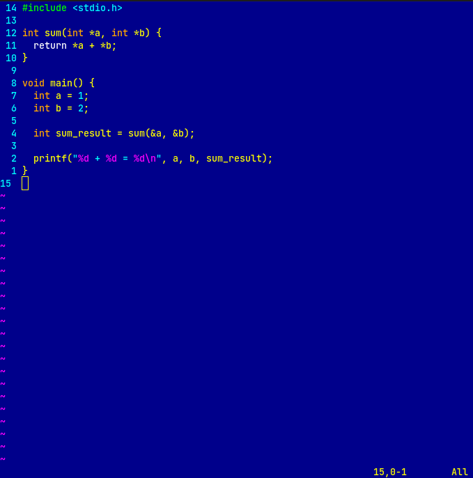

## Darkblue

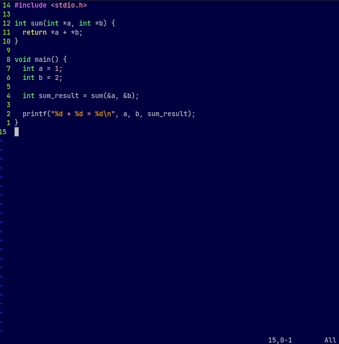

## Default

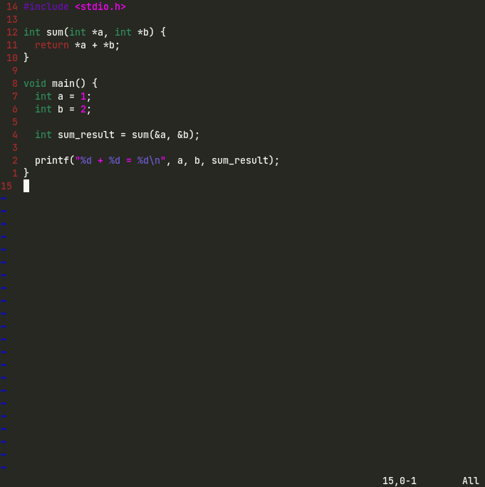

## Delek

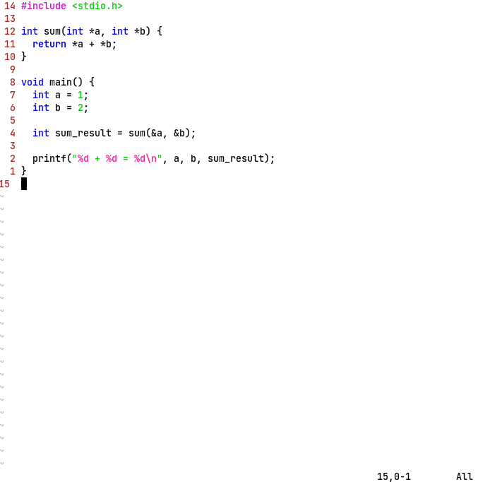

## Desert

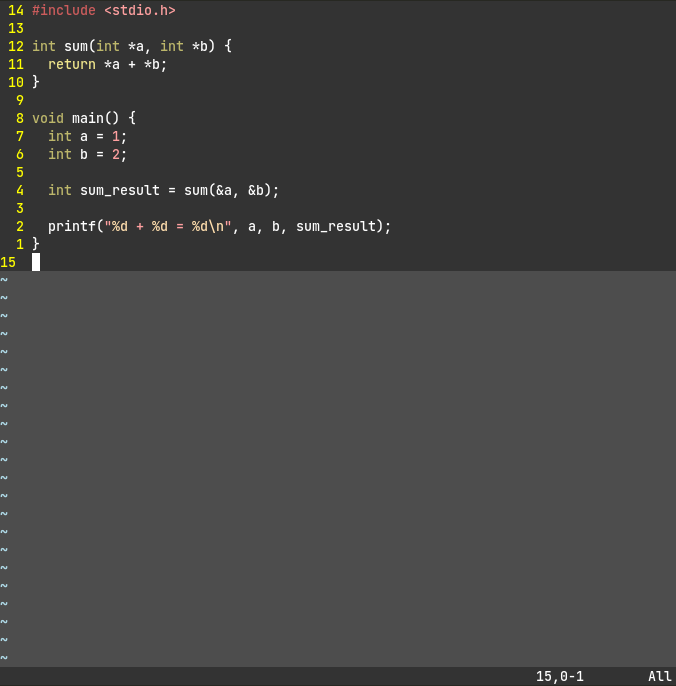

## Elflord

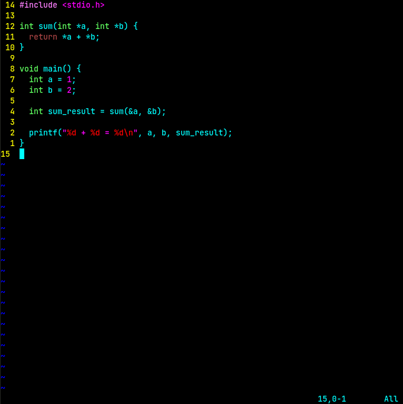

## Evening

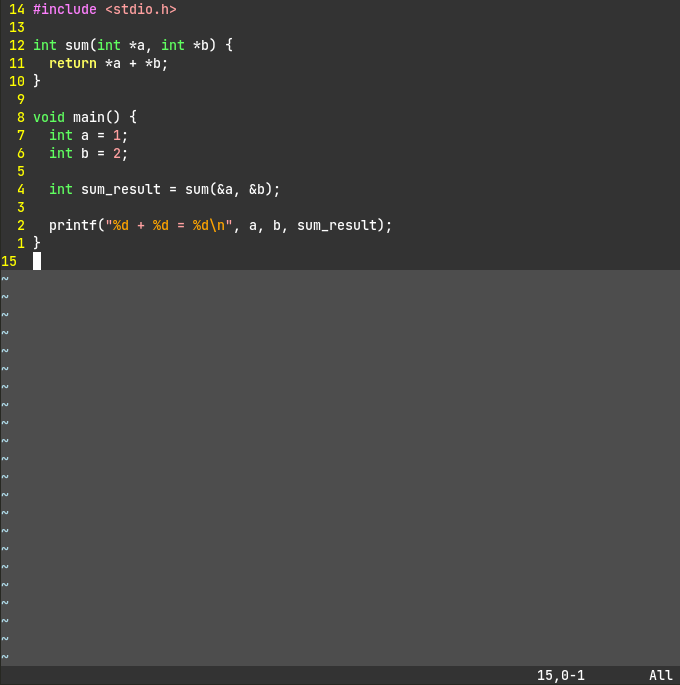

## Industry

## Koehler

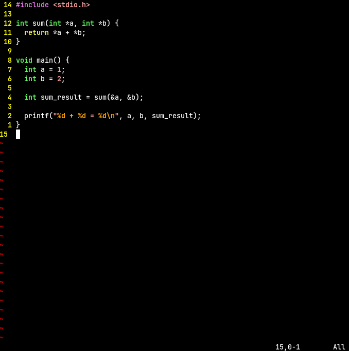

## Morning

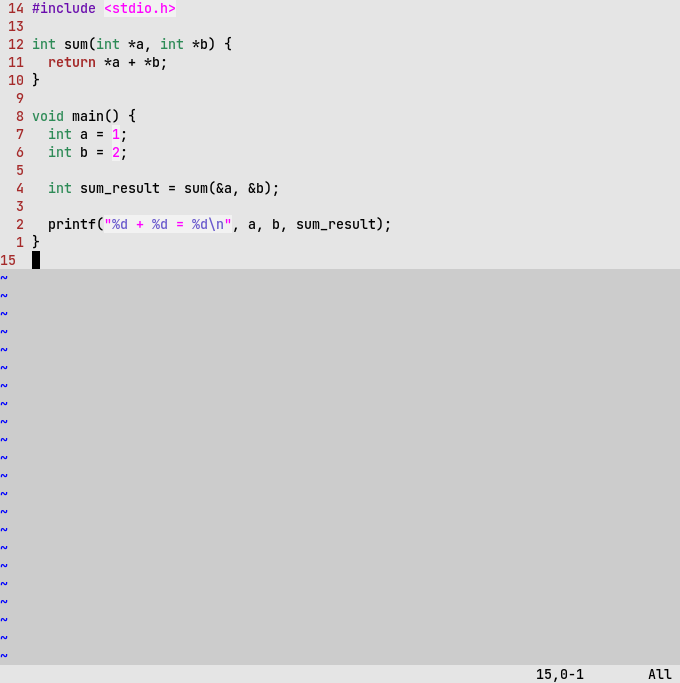

## Murphy

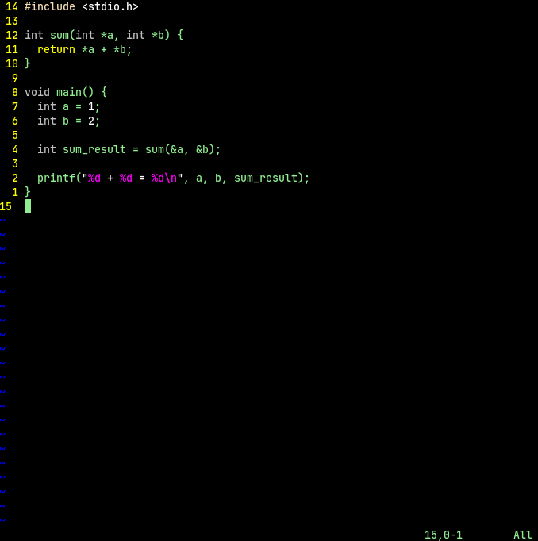

## Pablo

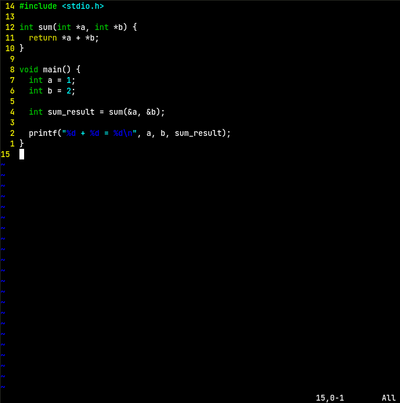

## Peachpuff

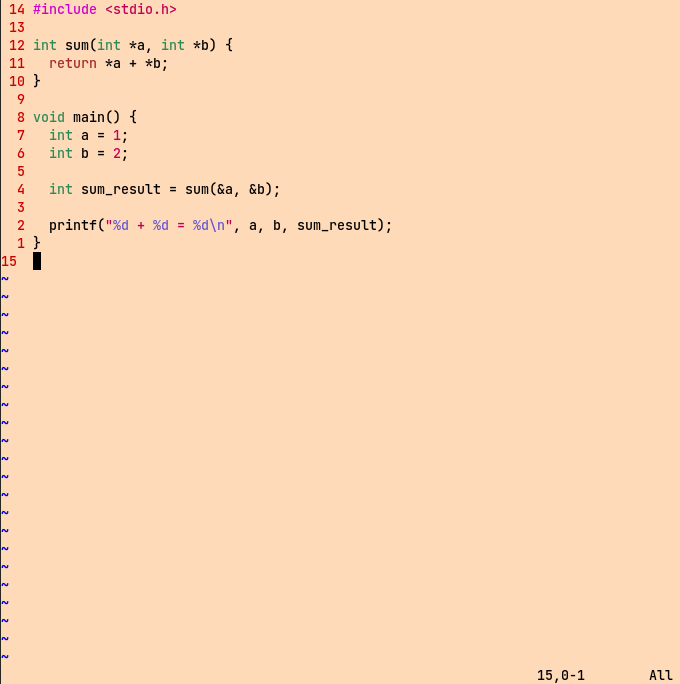

## Ron

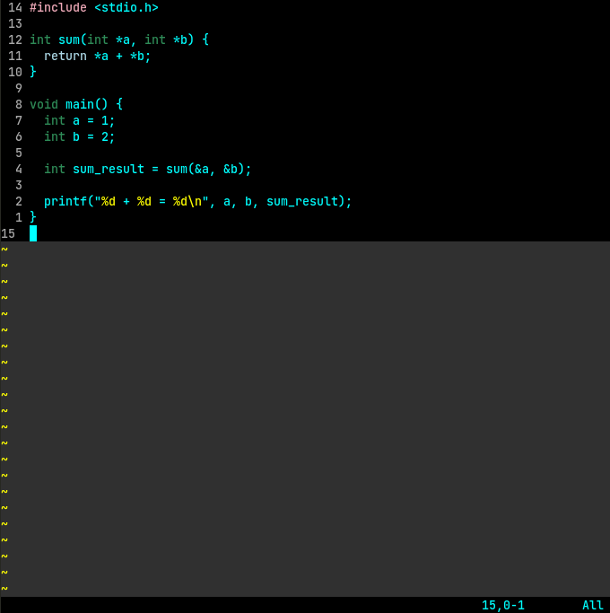

## Shine

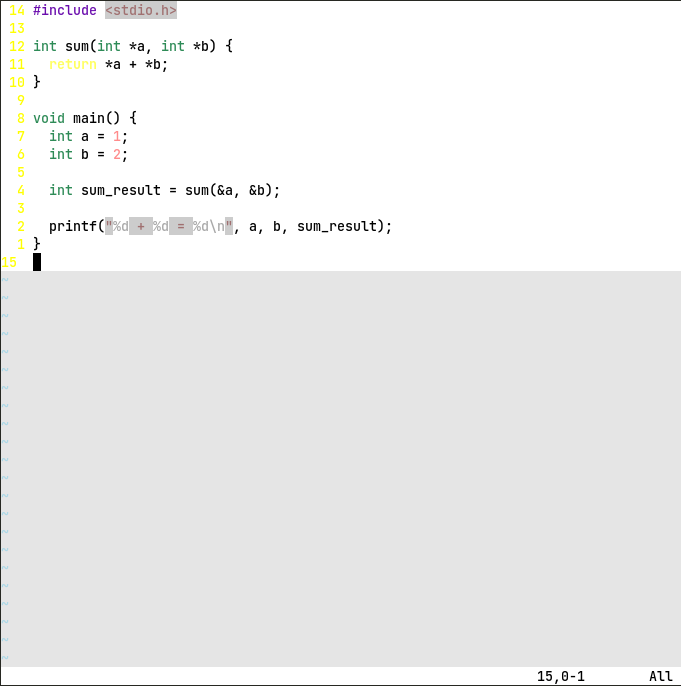

## Slate

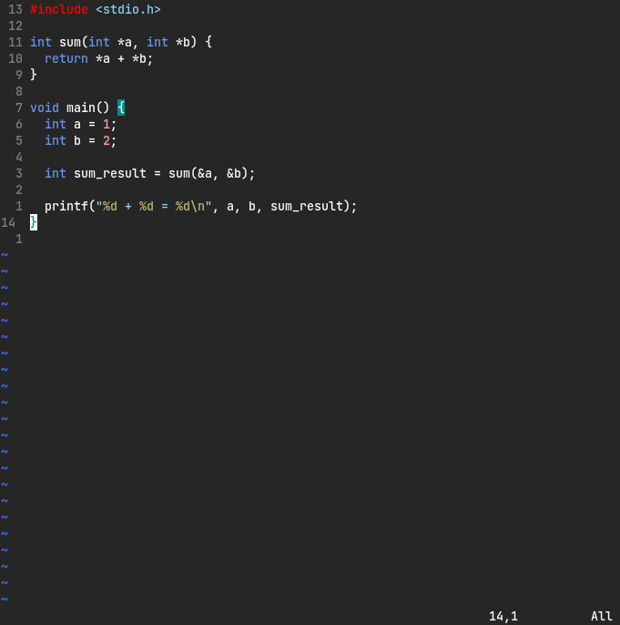

## Torte

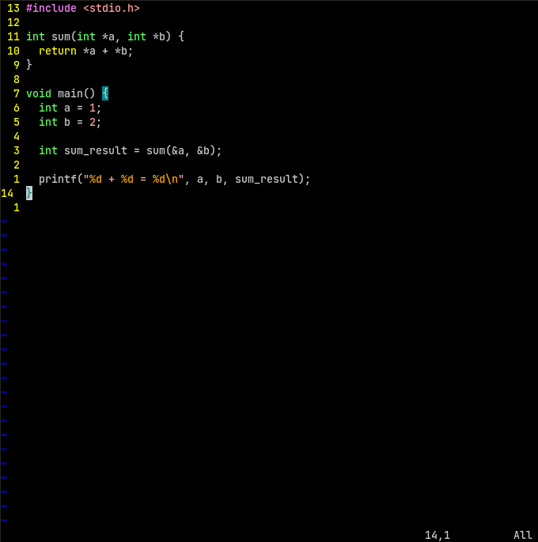

## Zellner

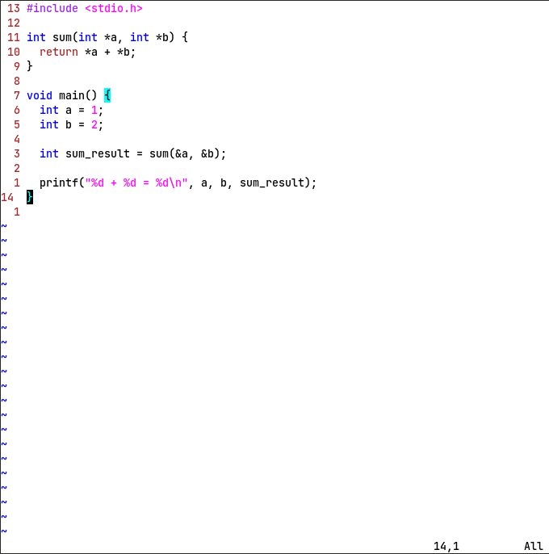
