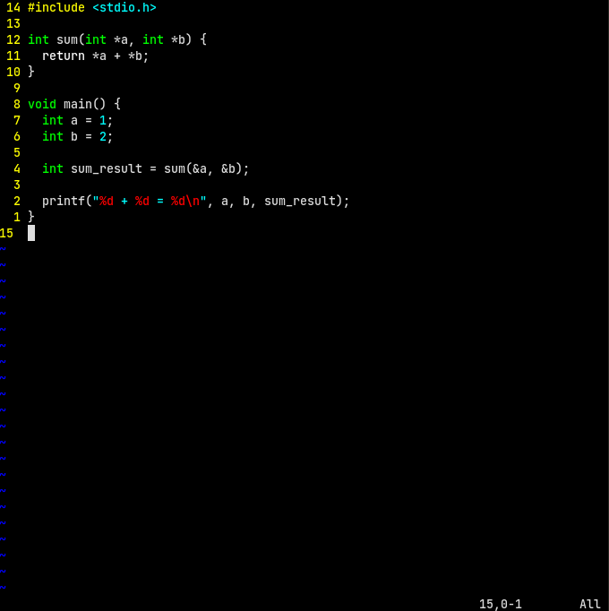

# All Built-In Vim colorschemes screenshots.

## Blue

## Darkblue

## Default

## Delek

## Desert

## Elflord

## Evening

## Industry

## Koehler

## Morning

## Murphy

## Pablo

## Peachpuff

## Ron

## Shine

## Slate

## Torte

## Zellner

